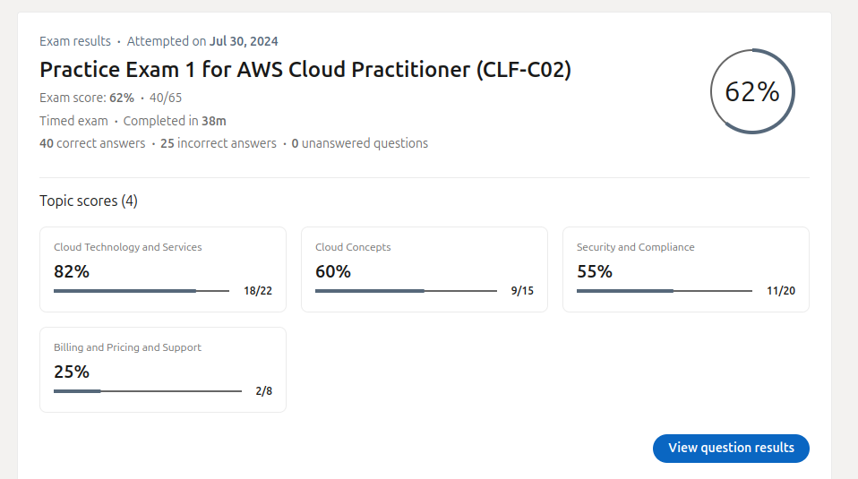

# This repo is for my daily logs of the Cloud Practioner exam preparation journey using Udemy Course by Stephane

## The course is called "AWS Certified Cloud Practitioner 2020-Real Exam Practice Tests" by Stephane Maarek

* The course is available at https://www.udemy.com/course/aws-certified-cloud-practitioner-practice-exams-amazon/

### Day_01 - 2024-07-06

---

* Today's Progress:
  * Started the course
  * Completed the 3rd section - Introduction to Cloud Computing
  * Completed the 4th section - IAM (Identity and Access Management)
  

Key takeaways:

* IAM is a global service
* Practice least privilege for users
* Different types of policies: inline, group, managed
* IAM components: roles, policies, users, CLI
* Options for MFA devices in AWS
    1. Virtual MFA device
    2. Universal 2nd Factor (U2F) security key
    3. Hardware key fob MFA device
    4. Hardware key fob MFA device for AWS GovCloud (US)
* IAM Security Tools
  * IAM credentials Report (account level)
  * IAM Access Advisor (user level)

* Budget/Billing setup

### Day_02 - 2024-07-07

---

* Today's progress:
  * Completed the 5th section - EC2 (Elastic Compute Cloud)
  * Completed the 6th section - EC2 Storage (EBS and Instance Store)
  
  

  
Key takeaways:

  
  ## ec2
  * ec2 is a virtual server in the cloud
  * classic ports to know

    * 22=ssh
    * 21=ftp
    * 22=sftp
    * 80=http
    * 443=https
    * 3389=rdp (remote desktop protocol)

  Note:-use Ec2 IAM roles for the instances

  ### ec2 instance purchasing options

  1. On demand: coming and staying in resort whenever we like, we pay the full price
  2. Reserved: like planning ahead and if we plan to stay for a long time, we may get a good discount.
  3. Savings Plans: pay a certain amount per hour for certain period and stay in any room type (e.g.,
  King, Suite, Sea View, …)
  4. Spot instances: the hotel allows people to bid for the empty rooms and the highest bidder keeps the
  rooms. You can get kicked out at any time
  5. Dedicated Hosts: We book an entire building of the resort
  6. Capacity Reservations: you book a room for a period with full price even you don’t stay in it

     * summary
  ec2 - AMI(os), CPU, RAM, STORAGE, S.G, USER DATA

  ## EC2 Instance Storage

  * Summary
  * EBS volumes:
    * network drives attached to one EC2 instance at a time
    * Mapped to an Availability Zones
    * Can use EBS Snapshots for backups / transferring EBS volumes across AZ
  * AMI: create ready-to-use EC2 instances with our customizations
  * EC2 Image Builder: automatically build, test and distribute AMIs
  * EC2 Instance Store:
    * High performance hardware disk attached to our EC2 instance
    * Lost if our instance is stopped / terminated
  * EFS: network file system, can be attached to 100s of instances in a region
  * EFS-IA: cost-optimized storage class for infrequent accessed files
  * FSx for Windows: Network File System for Windows servers
  * FSx for Lustre: High Performance Computing Linux file system

  
## practise exams

* using linkedin learning

  1. AWS Certified Cloud Practitioner (CLF-C02) Cert Prep: 1
  

## Finished the course and PASSED my CCP exams. [see it here](https://www.linkedin.com/posts/ronney-otieno_forever-aws-cloudcomputing-activity-7233166937462063104-YDjb?utm_source=share&utm_medium=member_desktop)
